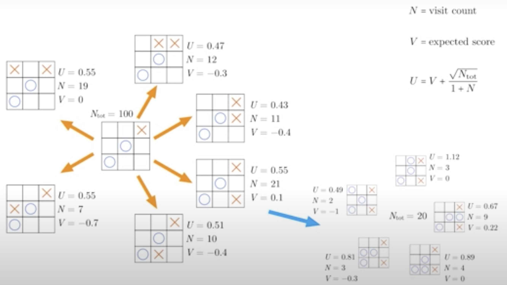
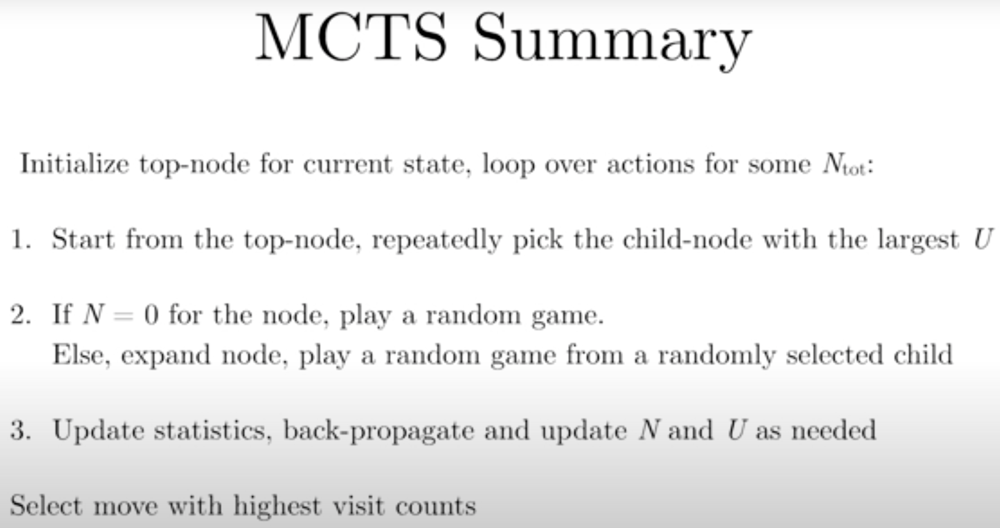
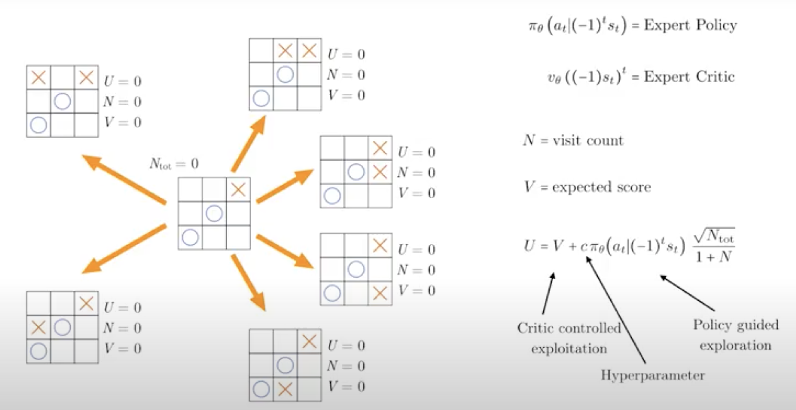

# AlphaZero Documentation

I include below my personal notes on a few documents related to AlphAZero algorithm.

1. DeepMind's Original Paper
   [Nature paper](https://www.nature.com/articles/nature24270)

2. David Silver: AlphaGo, AlphaZero, and Deep Reinforcement Learning | Lex Fridman Podcast #86
[Link](https://www.youtube.com/watch?v=uPUEq8d73JI)

3. Udacity - Case Study on TicTacToe

Why is AlphaGo a significant breakthrough?

* **far more complex than chess**: 

the number of possible games is so high, that a professional go engine was believed to be way out of reach at that point, 

* "human intuition was believed to be a key component in professional play"
Are there other domains we have such beliefs? What is intuition?
 
* "alphago zero learned from playing against itself"
According to David Silver, it was the intent from the beginning of the development process (see podcast interview)

* "the algorithm was generic enough to be adapted to chess and shogi"
How to define generic?

* The best part of the alphazero algorithm is simplicity": a Monte Carlo tree search, guided by a deep neural network. 

* "analogous to the way humans think about board games" -- where professional players employ hard calculations guides with intuitions.
Can we really consider that AlphaGo use intuition?

Zero-Sum Game
Fully-Observable
Board representation
One common policy
One common critic

### Classical MCTS

### Improved MCTS

* The neural network takes as input the state and outputs both an expert policy (equivalent to an actor) and an expert critic (equivalent to a critic). In the Alpha Zero paper, both the policy and the critic share the same network, so the same weights $\theta$

3. Implementation Details
 
 - A short and effective introduction to AlphaZero is Surag Nair's
   [excellent tutorial](https://web.stanford.edu/~surag/posts/alphazero.html).
 - A good resource to learn about Monte Carlo Tree Search (MCTS) is this
   [Int8 tutorial](https://int8.io/monte-carlo-tree-search-beginners-guide/).
   [series of posts](https://medium.com/oracledevs/lessons-from-implementing-alphazero-7e36e9054191)
   from Oracle has been an important source of inspiration for `AlphaZero.jl`.
   It provides useful details on implementing asynchronous MCTS, along with
   an interesting discussion on hyperparameters tuning.

4. Discovery of AlphaZero.jl

[AlphaZero.jl](https://github.com/jonathan-laurent/AlphaZero.jl.git)
   

   
